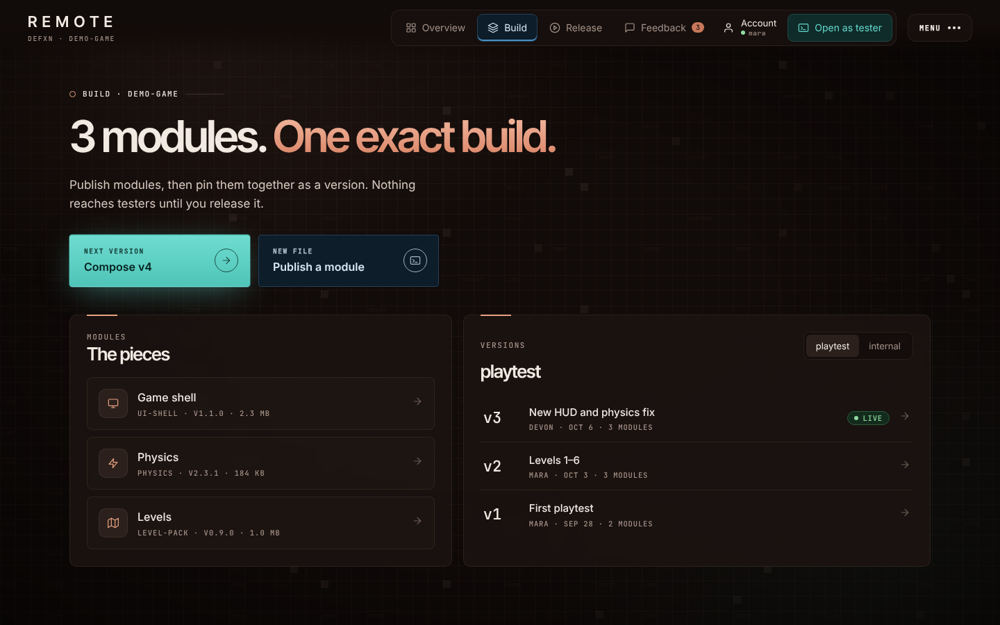
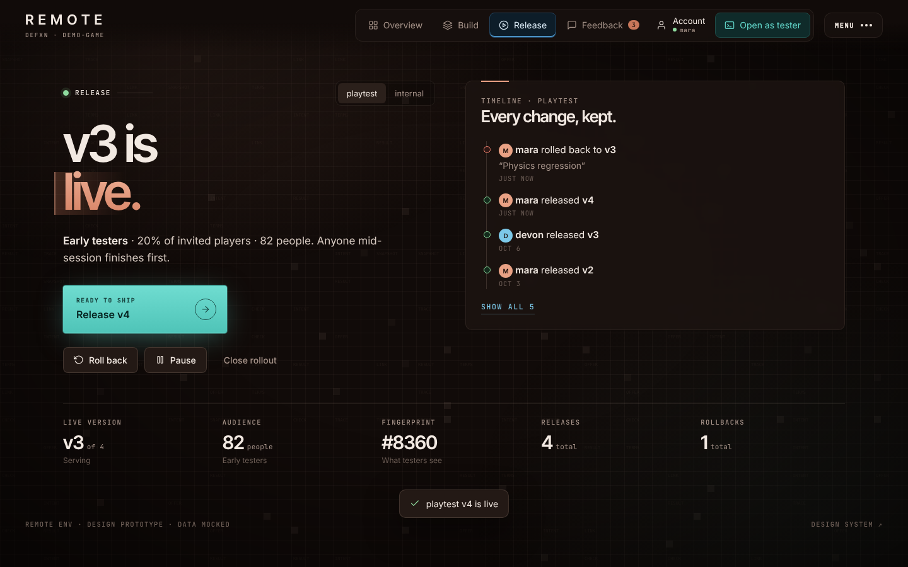
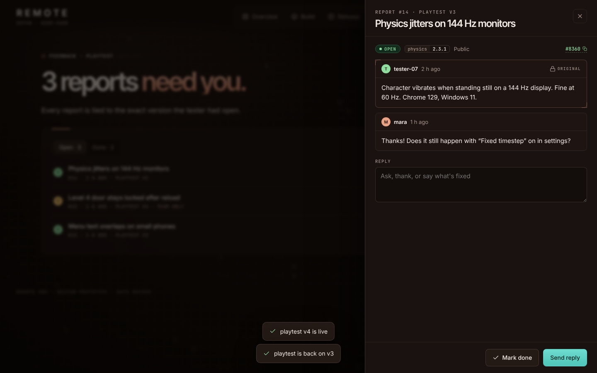
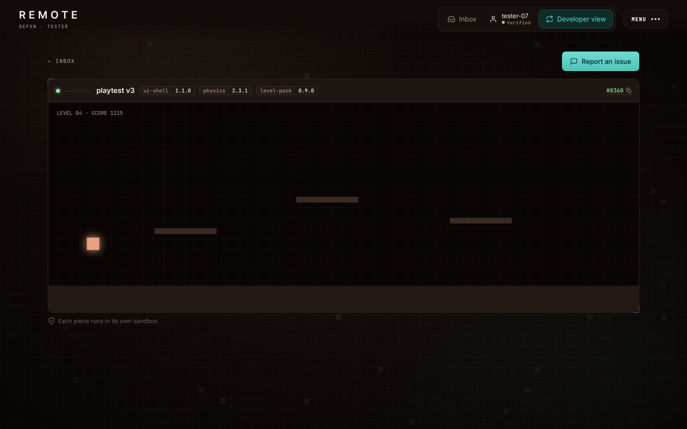
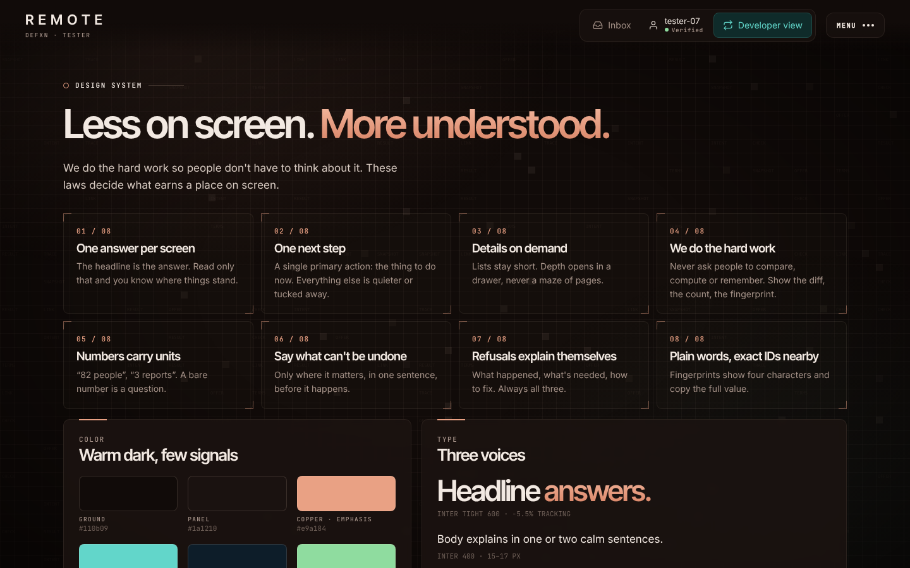

# SHARD — sovereign code mesh

> GitHub, redesigned without the hub. Every repo is a signed, content-addressed
> shard replicated peer-to-peer. No central server owns your code, your
> identity, your issues, or your history.

```
 ┌──────────┐   QUIC/Noise   ┌──────────┐   gossip    ┌──────────┐
 │  you     │◀──────────────▶│  teammate│◀───────────▶│  seed    │
 │  (node)  │   git packs    │  (node)  │  ref annc.  │  (node)  │
 └──────────┘                └──────────┘             └──────────┘
        ▲                         DHT: repo-id → who seeds it
        └──────────────────────────────────────────────────────┘
```

## What it is

- **Git underneath.** Repos are plain Git. `git push shard main` works.
  SHARD adds identity, signatures, replication and collaboration on top.
- **Self-sovereign identity.** You are an Ed25519 key, not an account row.
  Each device has its own key, certified by your root identity.
- **Real P2P.** libp2p transport (QUIC + Noise), Kademlia DHT for discovery,
  GossipSub for ref announcements, hole punching + relays for NAT.
- **Collaboration as data.** Issues, patches (PRs), reviews and releases are
  CRDT op-logs stored *inside the repo* as Git objects, so they replicate
  with the code and work offline.
- **Merges by quorum.** The canonical branch is whatever a threshold of
  repo delegates have signed. No admin panel can rewrite it.
- **Auditable history and safe rollback.** Every canonical ref move is a
  signed entry in a hash-chained ledger. A rollback is a new ledger entry,
  not deleted history, so it can always be undone.
- **Private by construction.** Private repos replicate only to authorized
  peers, and are end-to-end encrypted (MLS group keys) when stored on
  untrusted "blind" seeds.
- **Teams without a landlord.** Orgs are signed membership documents with
  roles and M-of-N policy thresholds.

## Contents

| Path | What |
|------|------|
| [`docs/ARCHITECTURE.md`](docs/ARCHITECTURE.md) | System design: identity, network, storage, merges, privacy, teams |
| [`docs/FLOWS.md`](docs/FLOWS.md) | Step-by-step user flows (CLI + UI): clone, commit, patch, review, merge, rollback, team, privacy |
| [`docs/DATA_MODEL.md`](docs/DATA_MODEL.md) | Ref layout, identity documents, collaborative object schemas, ledger format |
| [`docs/DESIGN_SYSTEM.md`](docs/DESIGN_SYSTEM.md) | The cyber visual language: color tokens, type, components, motion |
| [`docs/ROADMAP.md`](docs/ROADMAP.md) | Phased delivery plan and open questions |
| [`prototype/index.html`](prototype/index.html) | Clickable UI prototype (no build step: open in a browser) |

## Remote Env product design (prototype)

`prototype/index.html` is the **UI design** for Remote Env's developer and
tester surfaces, in the DEFXN visual language: warm near-black ground with a
faint labelled grid, copper emphasis, teal primary actions, navy secondary
actions, mono eyebrows and units, and framed archive-style panels. The
engineering team builds the product; this file shows what people see.

### Design law: never show too much

We do the hard work so people don't have to think. Every screen follows:

1. **One answer per screen.** The headline is the answer ("v3 is live for 82 testers.").
2. **One next step.** A single primary action, chosen from state (release v4 → review reports → compose).
3. **Details on demand.** Lists stay short; depth opens in a side drawer.
4. **We do the hard work.** Show the diff, the count, the fingerprint. Never ask people to compare or remember.
5. **Numbers carry units.** "82 people", "3 reports".
6. **Say what can't be undone,** only where it matters, before it happens.
7. **Refusals explain themselves:** what happened, what's needed, how to fix.
8. **Plain words, exact IDs nearby.** Fingerprints show 4 characters and copy the full value.

### Surfaces

- **Overview**: the state as a headline, the live build diagram (modules → environment version, checks, fingerprint), a 5-step progress tracker, and a stats strip.
- **Build**: module tiles (drawer: versions, publish, revoke) and environment versions (drawer: diff, release, roll back). Compose a new version in one dialog.
- **Release**: live state, one primary action, guarded roll back and close, a short timeline that expands.
- **Feedback**: open and done lists; each report opens in a drawer with the locked original, corrections, reply and mark done.
- **Menu**: Activity, People & keys, switch view, Design system.
- **Tester**: inbox, the "Confirm it's you → Check access → Unlock" steps, the run screen with an exact version bar, and a two-field report form.
- **Design system** (`#/system`): the laws, color, type, components and a UI-to-protocol term table for the devs.

Data and actions are mocked in the page.

```sh
xdg-open prototype/index.html    # or: open prototype/index.html
```

| Overview | Build |
|---|---|
|  |  |
| **Release** | **Report drawer** |
|  |  |
| **Tester run screen** | **Design system** |
|  |  |
