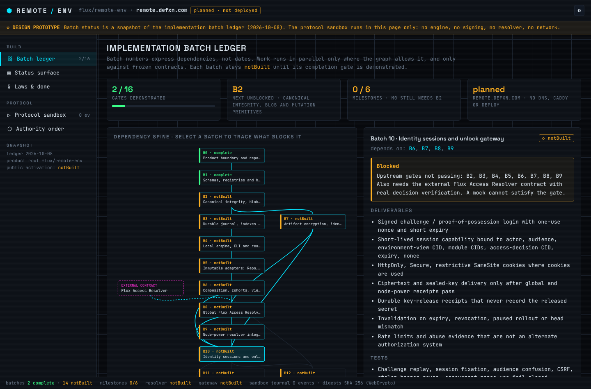
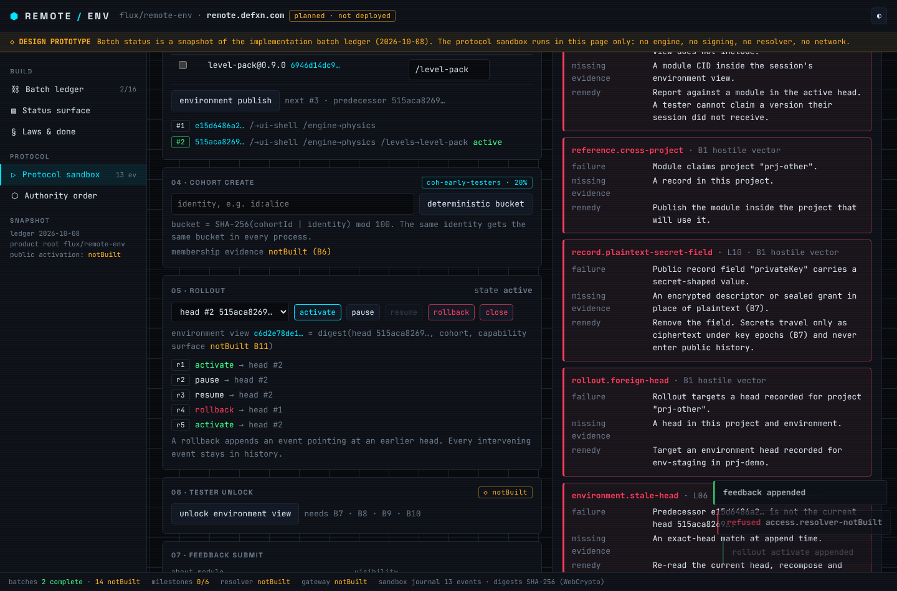
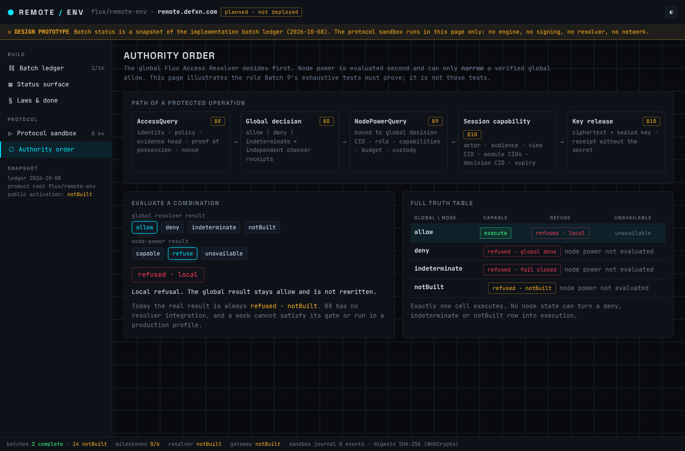
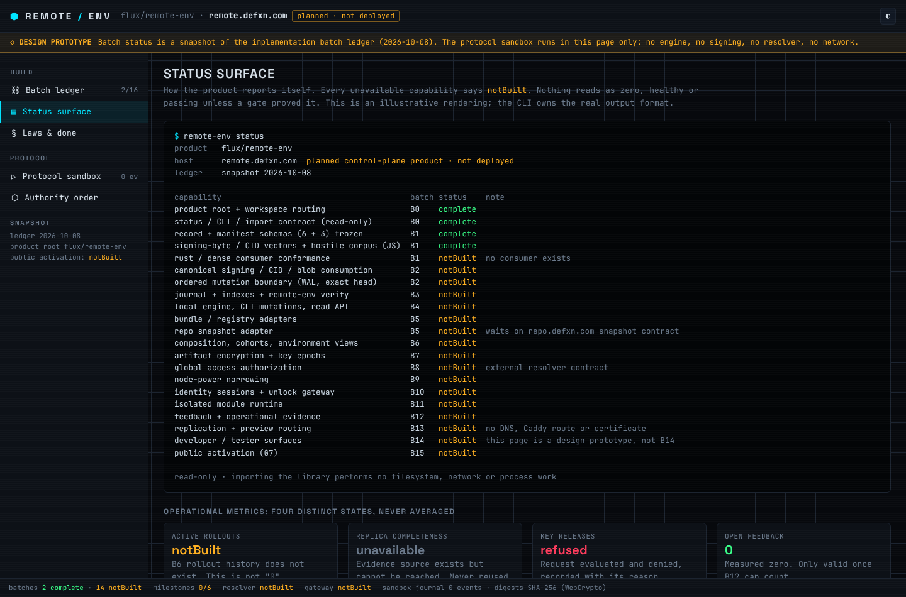

# SHARD — sovereign code mesh

> GitHub, redesigned without the hub. Every repo is a signed, content-addressed
> shard replicated peer-to-peer. No central server owns your code, your
> identity, your issues, or your history.

```
 ┌──────────┐   QUIC/Noise   ┌──────────┐   gossip    ┌──────────┐
 │  you     │◀──────────────▶│  teammate│◀───────────▶│  seed    │
 │  (node)  │   git packs    │  (node)  │  ref annc.  │  (node)  │
 └──────────┘                └──────────┘             └──────────┘
        ▲                         DHT: repo-id → who seeds it
        └──────────────────────────────────────────────────────┘
```

## What it is

- **Git underneath.** Repos are plain Git. `git push shard main` works.
  SHARD adds identity, signatures, replication and collaboration on top.
- **Self-sovereign identity.** You are an Ed25519 key, not an account row.
  Each device has its own key, certified by your root identity.
- **Real P2P.** libp2p transport (QUIC + Noise), Kademlia DHT for discovery,
  GossipSub for ref announcements, hole punching + relays for NAT.
- **Collaboration as data.** Issues, patches (PRs), reviews and releases are
  CRDT op-logs stored *inside the repo* as Git objects, so they replicate
  with the code and work offline.
- **Merges by quorum.** The canonical branch is whatever a threshold of
  repo delegates have signed. No admin panel can rewrite it.
- **Auditable history and safe rollback.** Every canonical ref move is a
  signed entry in a hash-chained ledger. A rollback is a new ledger entry,
  not deleted history, so it can always be undone.
- **Private by construction.** Private repos replicate only to authorized
  peers, and are end-to-end encrypted (MLS group keys) when stored on
  untrusted "blind" seeds.
- **Teams without a landlord.** Orgs are signed membership documents with
  roles and M-of-N policy thresholds.

## Contents

| Path | What |
|------|------|
| [`docs/ARCHITECTURE.md`](docs/ARCHITECTURE.md) | System design: identity, network, storage, merges, privacy, teams |
| [`docs/FLOWS.md`](docs/FLOWS.md) | Step-by-step user flows (CLI + UI): clone, commit, patch, review, merge, rollback, team, privacy |
| [`docs/DATA_MODEL.md`](docs/DATA_MODEL.md) | Ref layout, identity documents, collaborative object schemas, ledger format |
| [`docs/DESIGN_SYSTEM.md`](docs/DESIGN_SYSTEM.md) | The cyber visual language: color tokens, type, components, motion |
| [`docs/ROADMAP.md`](docs/ROADMAP.md) | Phased delivery plan and open questions |
| [`prototype/index.html`](prototype/index.html) | Clickable UI prototype (no build step: open in a browser) |

## Remote Env console (prototype)

`prototype/index.html` is the developer console for **Remote Env**
(`flux/remote-env`, planned at `remote.defxn.com`), driven by the
implementation batch ledger. It shows what is behind the scenes and never
presents a missing capability as working:

- **Batch ledger**: dependency spine for batches 0–15. Select a batch to see
  its deliverables, tests, completion gate and what upstream blocks it.
  Includes the M0–M5 milestones. Snapshot: B0 and B1 complete, B2–B15 `notBuilt`.
- **Status surface**: how `remote-env status` reports each capability, and how
  `notBuilt`, `unavailable`, `refused` and measured zero stay distinct.
- **Laws & done**: the laws that apply to every batch, the definition of done
  and the ownership boundaries.
- **Protocol sandbox**: an in-page append-only journal for project → module →
  environment → cohort → rollout → feedback. It runs the hostile vectors
  (mutable `latest`, duplicate mounts, stale heads, foreign heads, plaintext
  secrets, out-of-view feedback). Every refusal names the failure, the missing
  evidence and the remedy. Unlock always refuses as `notBuilt` (needs B7–B10).
- **Authority order**: global resolver first, node power only narrows an allow,
  shown as a full truth table.

The sandbox is simulated. Records are unsigned, digests are SHA-256 of
sorted-key JSON (not Flux CIDs), and the reason codes are illustrative. The
frozen schemas and codes live in `flux/remote-env`.

```sh
xdg-open prototype/index.html    # or: open prototype/index.html
```

| Batch ledger | Protocol sandbox |
|---|---|
|  |  |
| **Authority order** | **Status surface** |
|  |  |
