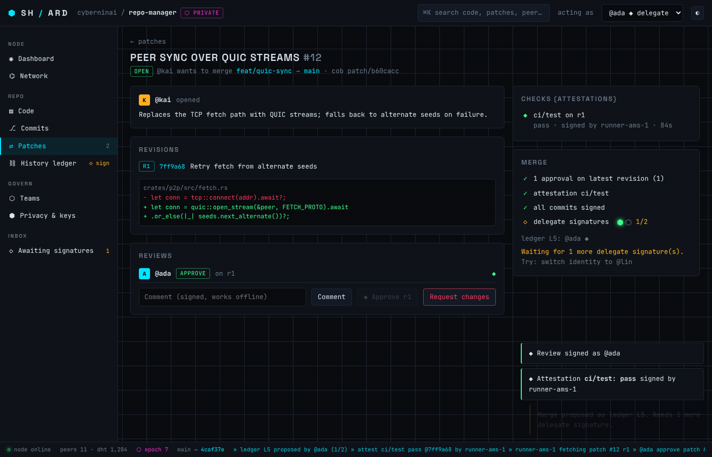
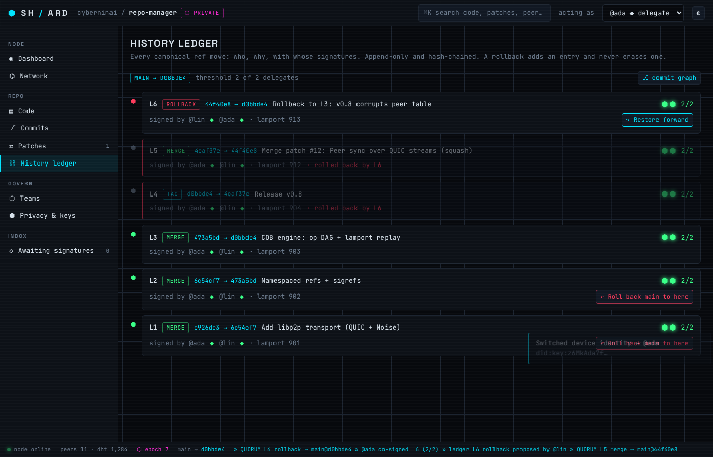
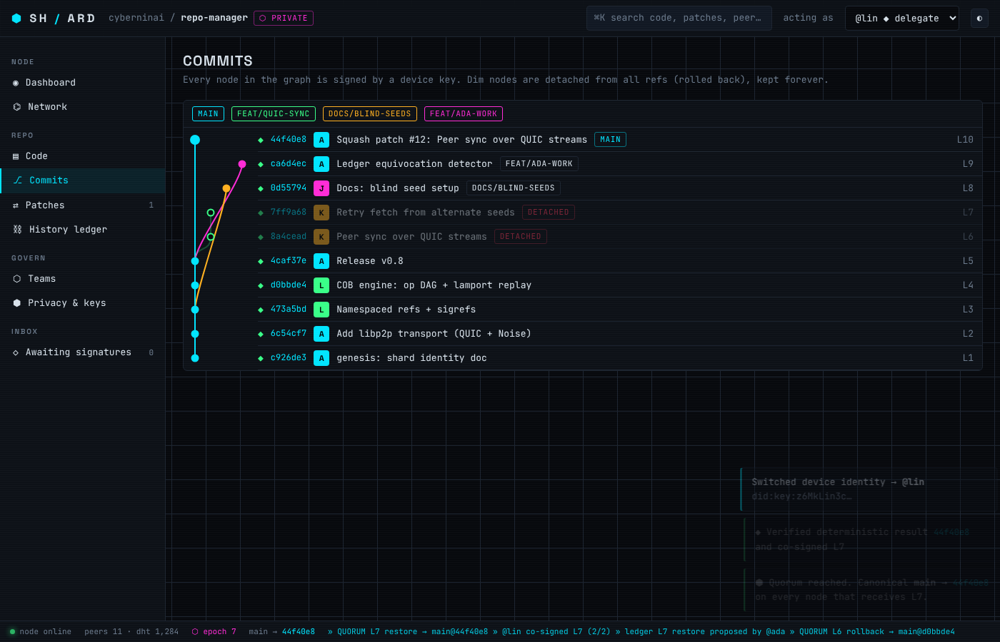
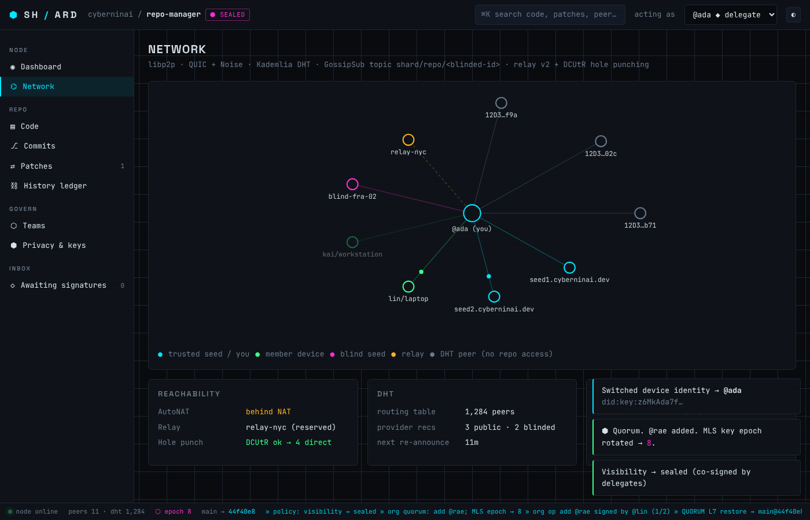

# SHARD — sovereign code mesh

> GitHub, redesigned without the hub. Every repo is a signed, content-addressed
> shard replicated peer-to-peer. No central server owns your code, your
> identity, your issues, or your history.

```
 ┌──────────┐   QUIC/Noise   ┌──────────┐   gossip    ┌──────────┐
 │  you     │◀──────────────▶│  teammate│◀───────────▶│  seed    │
 │  (node)  │   git packs    │  (node)  │  ref annc.  │  (node)  │
 └──────────┘                └──────────┘             └──────────┘
        ▲                         DHT: repo-id → who seeds it
        └──────────────────────────────────────────────────────┘
```

## What it is

- **Git underneath.** Repos are plain Git. `git push shard main` works.
  SHARD adds identity, signatures, replication and collaboration on top.
- **Self-sovereign identity.** You are an Ed25519 key, not an account row.
  Each device has its own key, certified by your root identity.
- **Real P2P.** libp2p transport (QUIC + Noise), Kademlia DHT for discovery,
  GossipSub for ref announcements, hole punching + relays for NAT.
- **Collaboration as data.** Issues, patches (PRs), reviews and releases are
  CRDT op-logs stored *inside the repo* as Git objects, so they replicate
  with the code and work offline.
- **Merges by quorum.** The canonical branch is whatever a threshold of
  repo delegates have signed. No admin panel can rewrite it.
- **Auditable history and safe rollback.** Every canonical ref move is a
  signed entry in a hash-chained ledger. A rollback is a new ledger entry,
  not deleted history, so it can always be undone.
- **Private by construction.** Private repos replicate only to authorized
  peers, and are end-to-end encrypted (MLS group keys) when stored on
  untrusted "blind" seeds.
- **Teams without a landlord.** Orgs are signed membership documents with
  roles and M-of-N policy thresholds.

## Contents

| Path | What |
|------|------|
| [`docs/ARCHITECTURE.md`](docs/ARCHITECTURE.md) | System design: identity, network, storage, merges, privacy, teams |
| [`docs/FLOWS.md`](docs/FLOWS.md) | Step-by-step user flows (CLI + UI): clone, commit, patch, review, merge, rollback, team, privacy |
| [`docs/DATA_MODEL.md`](docs/DATA_MODEL.md) | Ref layout, identity documents, collaborative object schemas, ledger format |
| [`docs/DESIGN_SYSTEM.md`](docs/DESIGN_SYSTEM.md) | The cyber visual language: color tokens, type, components, motion |
| [`docs/ROADMAP.md`](docs/ROADMAP.md) | Phased delivery plan and open questions |
| [`prototype/index.html`](prototype/index.html) | Clickable UI prototype (no build step: open in a browser) |

## Try the prototype

```sh
open prototype/index.html        # macOS
xdg-open prototype/index.html    # Linux
```

Everything in it runs in-memory: make commits, open a patch, collect
review signatures, merge at quorum, roll the branch back, add a team
member (watch the key epoch rotate), and flip privacy settings.

## Screens

| Merge waiting on delegate quorum | Ledger after a rollback |
|---|---|
|  |  |
| **Commit graph (detached commits kept)** | **P2P network view** |
|  |  |
