# defxn: platform UI + Scoped Claim Authorization

Everything for the defxn design stream, in one folder. The paths inside
are relative to this folder (`docs/…`, `prototype/…`), so the links below
and the links between files all work from here.

## defxn platform (design prototype)

The full defxn product UI: Overview, Account, mesh Directory, Treasury,
Deposits, Content (CMS) with editor, Deploy, and a Signed claims record.
Every signing action on every page goes through the one Scoped Claim
Authorization dialog below.

| Path | What |
|------|------|
| [`docs/defxn/PLATFORM.md`](docs/defxn/PLATFORM.md) | IA, shell, signing entry-point matrix, every page, states, responsive rules |
| [`prototype/defxn/index.html`](prototype/defxn/index.html) | Working vanilla-JS app; flows update balances, ledgers, page status, deploy history and the claims record |

```sh
cd prototype && python3 -m http.server 8000   # then open http://localhost:8000/defxn/
```

| Overview | Treasury | Deploy |
|---|---|---|
| 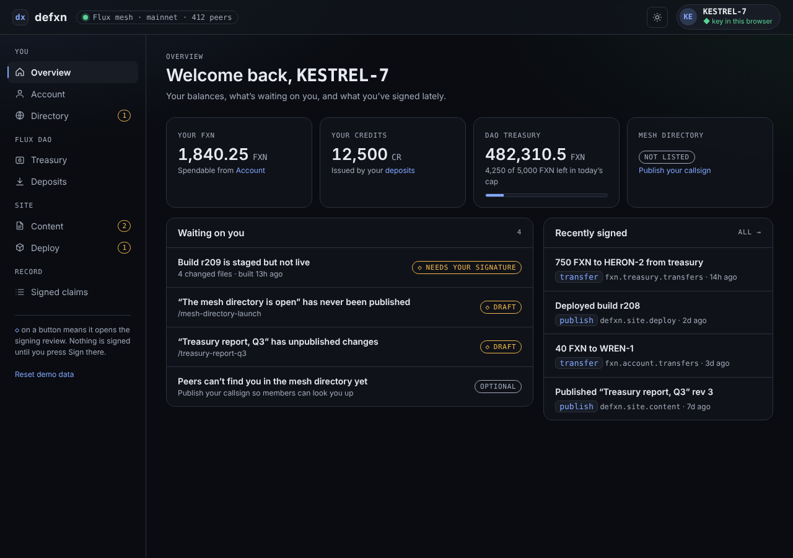 | 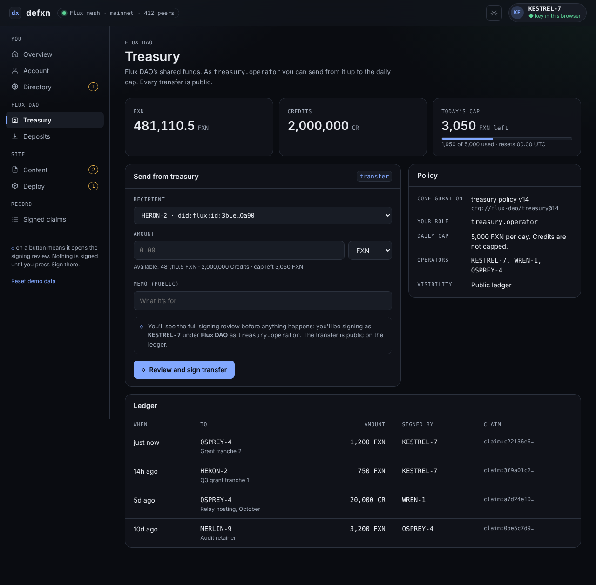 | 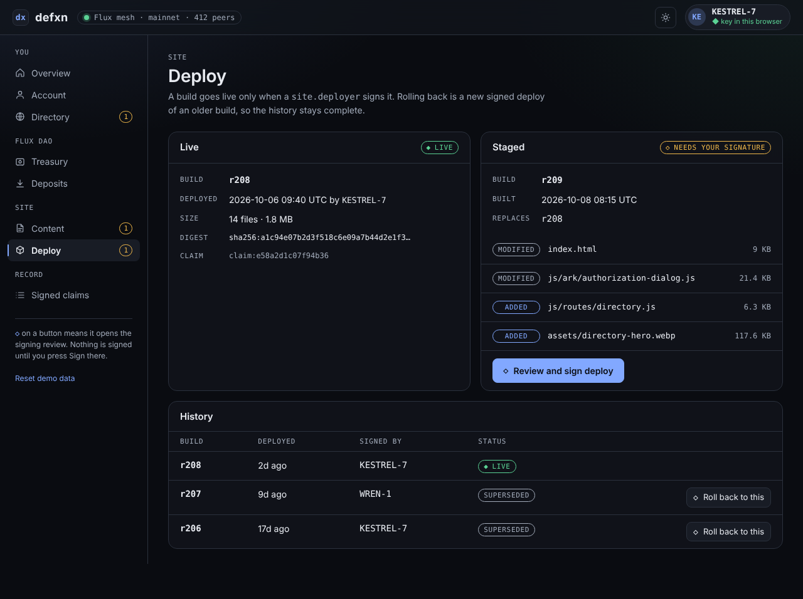 |
| **Directory (light)** | **Content editor** | **Signed claims** |
| 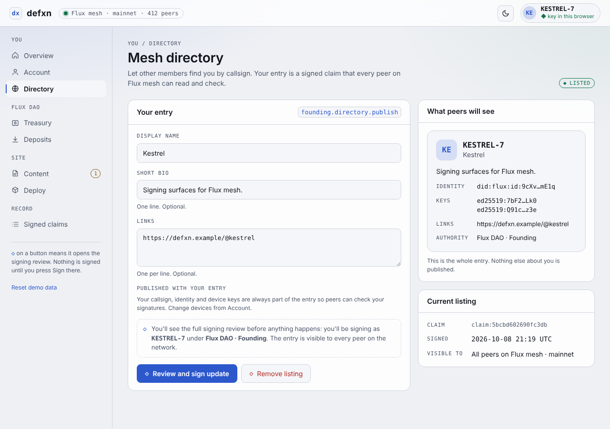 | 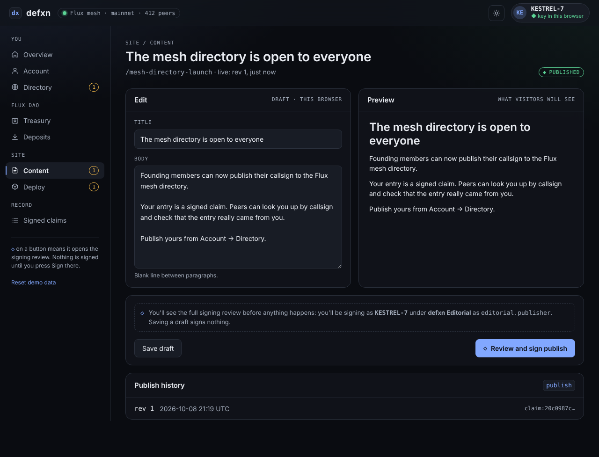 | 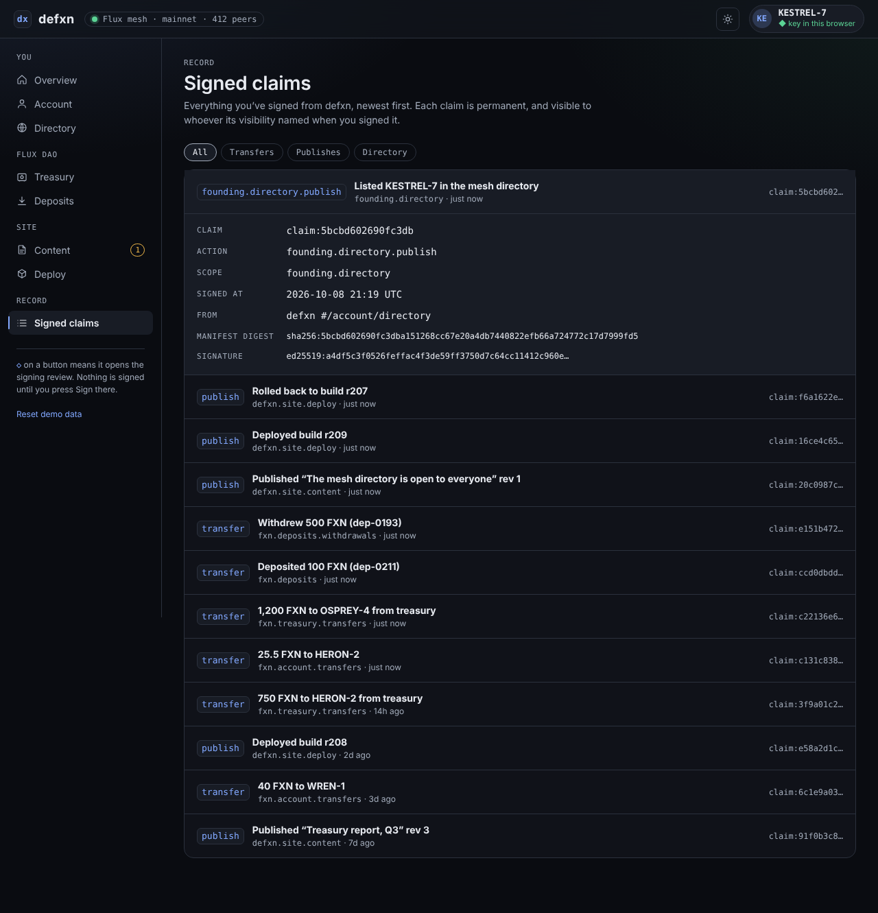 |

## Scoped Claim Authorization (defxn design stream)

One signing modal for every identity-bound action on defxn: FXN / Credits
transfers, CMS publishing, and publishing an identity to the mesh directory.
All 13 fields every time, no reduced variant.

| Path | What |
|------|------|
| [`docs/scoped-claim-authorization/SPEC.md`](docs/scoped-claim-authorization/SPEC.md) | Field contract, hierarchy, states, entry-point matrix, anatomy, tokens, wrapper contract, identity-publish flow |
| [`docs/scoped-claim-authorization/RESEARCH_PLAN.md`](docs/scoped-claim-authorization/RESEARCH_PLAN.md) | Study protocol and report template (no sessions run yet) |
| [`prototype/scoped-claim/sca-dialog.js`](prototype/scoped-claim/sca-dialog.js) | The dialog component (`SCA.request()`), shared by the platform and the review harness |
| [`prototype/scoped-claim/index.html`](prototype/scoped-claim/index.html) | Review harness: 3 actions × 6 states, light/dark, real SHA-256 digest check |
| [`prototype/scoped-claim/check-contrast.cjs`](prototype/scoped-claim/check-contrast.cjs) | Contrast gate for the token pairs the modal renders |

```sh
cd prototype/scoped-claim && python3 -m http.server 8000   # needs http(s) for crypto.subtle
node prototype/scoped-claim/check-contrast.cjs
```

| Transfer (dark) | Identity → mesh (light) | Signed receipt |
|---|---|---|
| 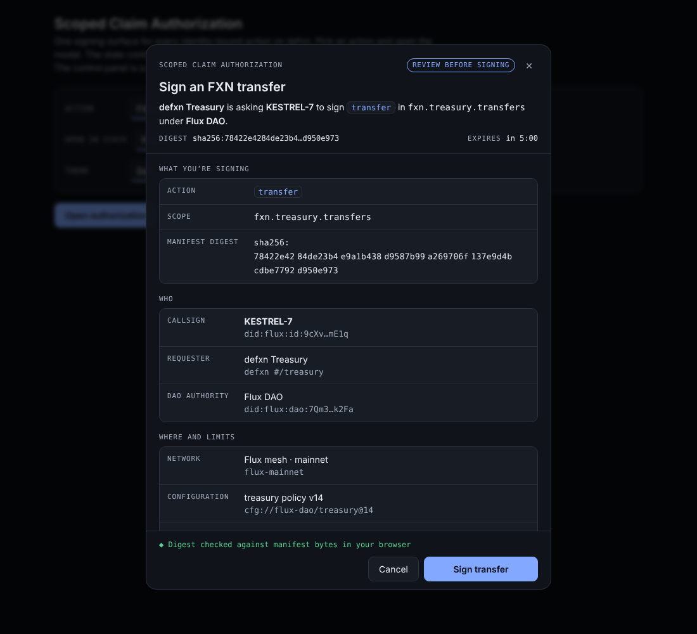 | 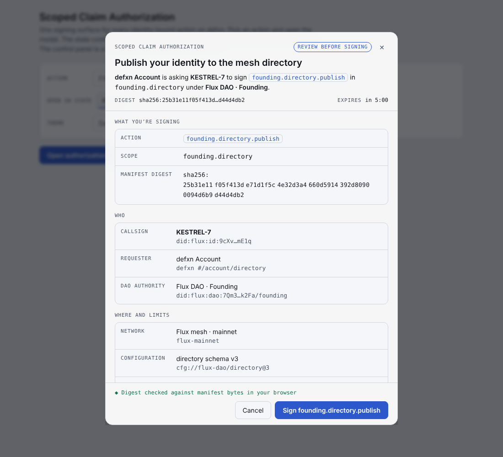 | 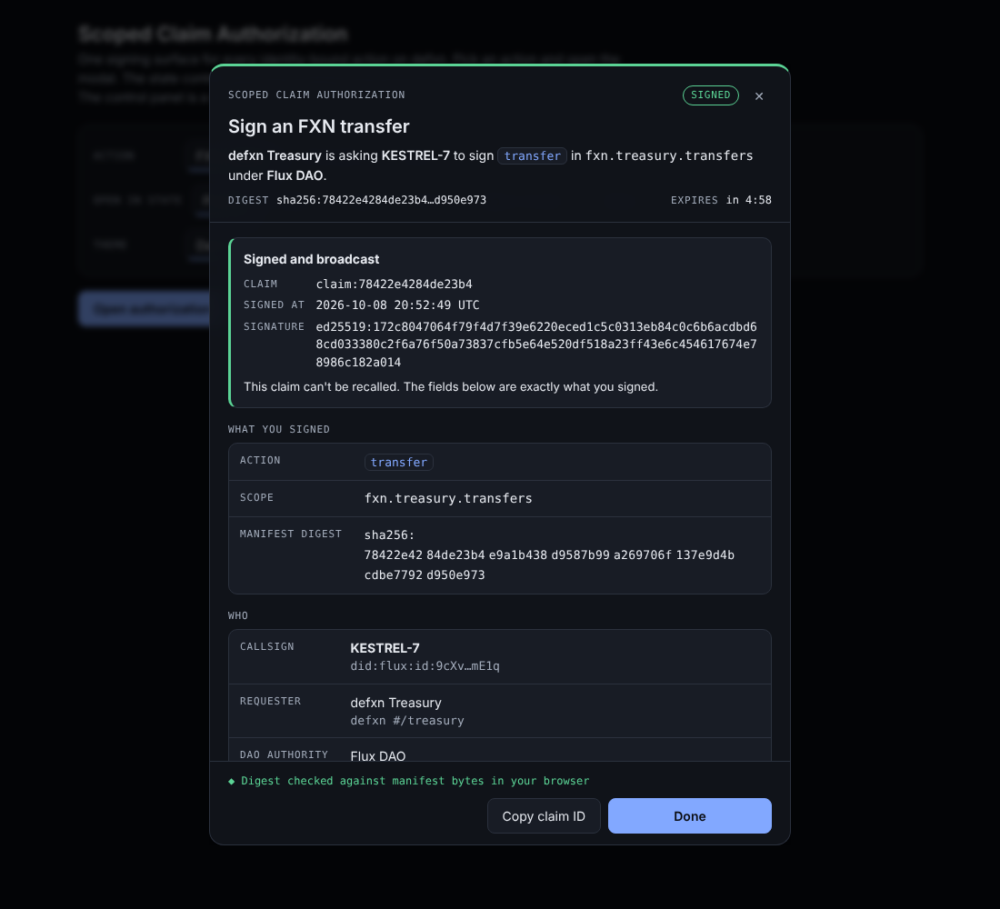 |
| **Digest mismatch** | **Exact bytes layer** | **Phone** |
| 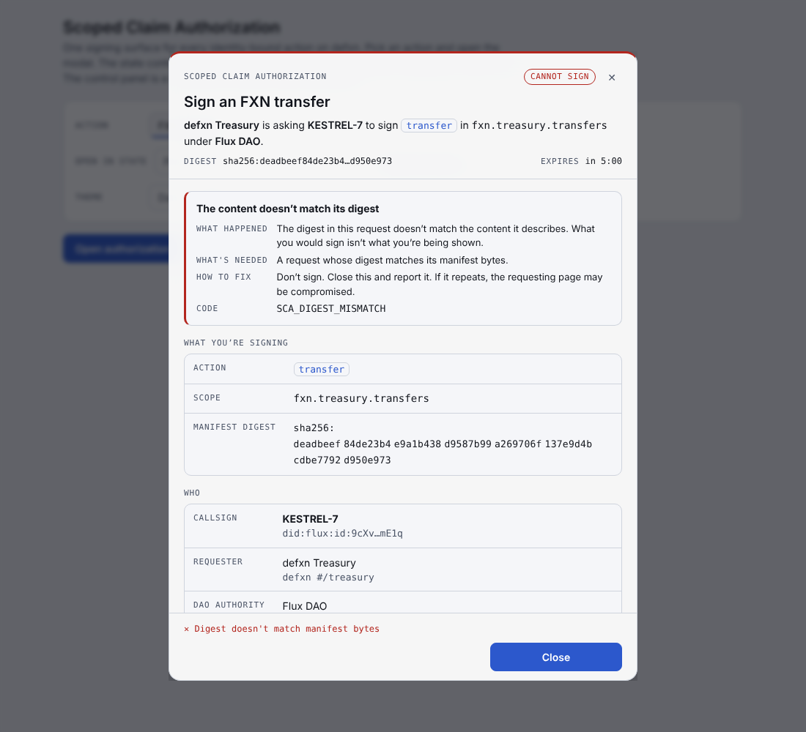 | 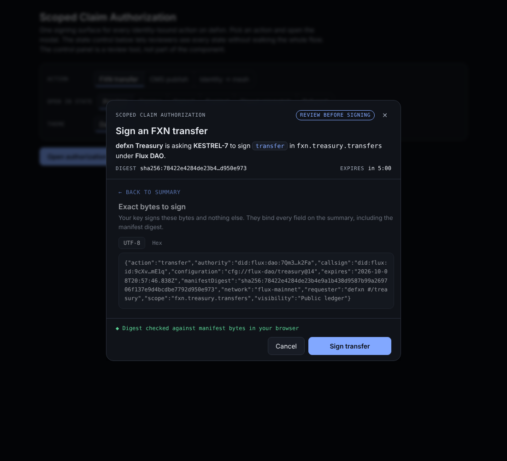 | 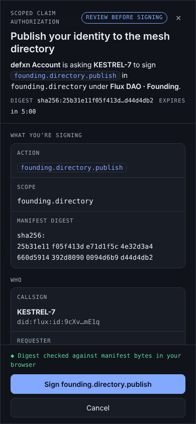 |
